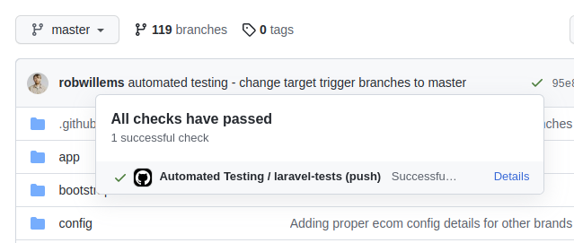
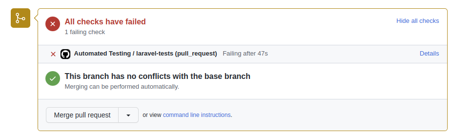
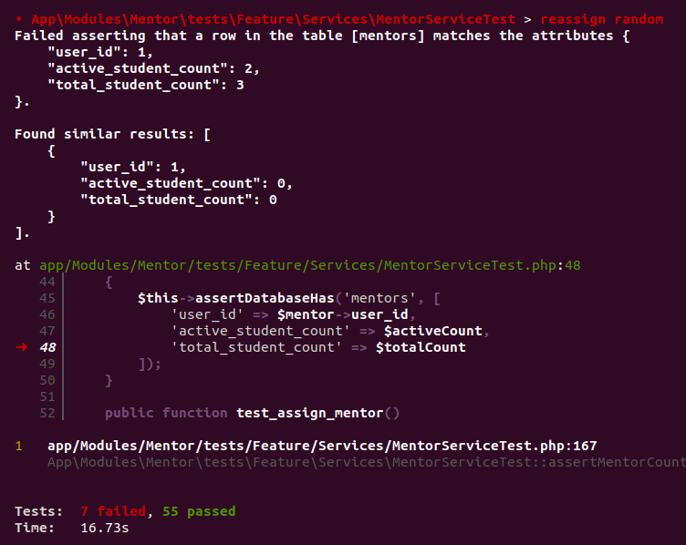
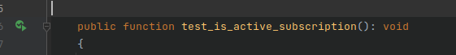

# Automated Testing

Any push or pull request into the main branch will trigger the Automated Testing GitHub action.

All tests in the Unit and Feature test suites will be run as defined in phpunit.xml.

For more details on the action check out https://github.com/railroadmedia/musora-web-platform/actions/workflows/automated-testing.yaml

### Push

A push to main may inadvertently break the tests and result in a red X next to the branch.
For the time being this branch will be monitored by Rob to see how often we break it.



### Pull Requests

The Automated Testing action must pass for the user to be able to complete the "Merge pull request" action.

If a developer breaks the tests they will be required to fix them before merge.



### Debugging failed tests

To run the test suite locally execute:
```
r mwp artisan test
```

The command outputs pass/fail results


If you have debugging setup you can step through tests from here to make it easier to pinpoint issues.

With phpstorm you can run tests individually simply by clicking on the green icon to the left the test function.




Please contact Rob if you need any help with debugging any failed tests.
